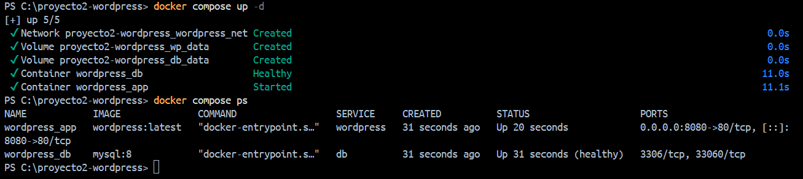
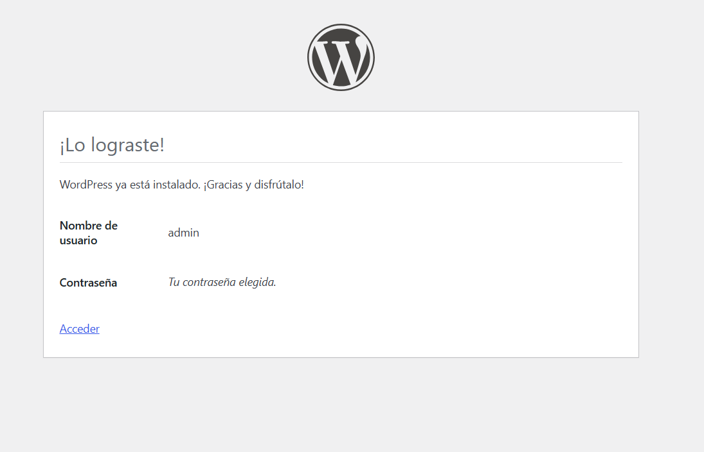
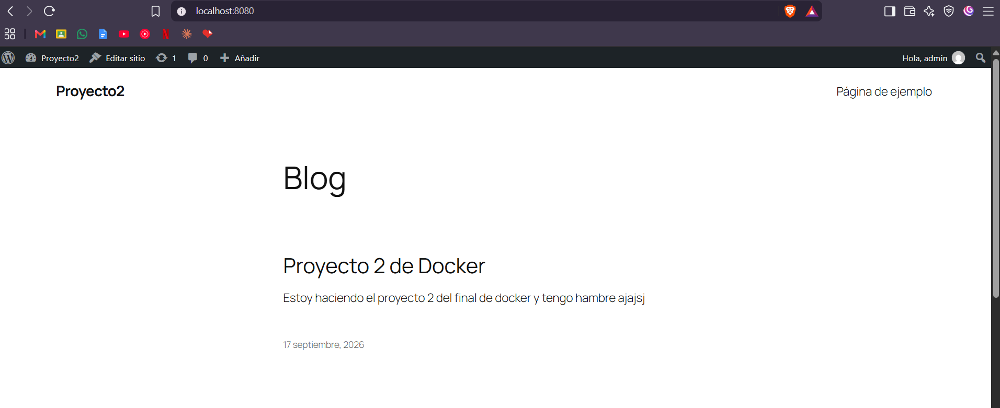
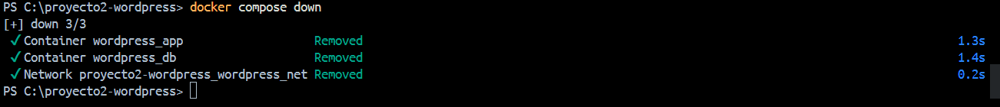
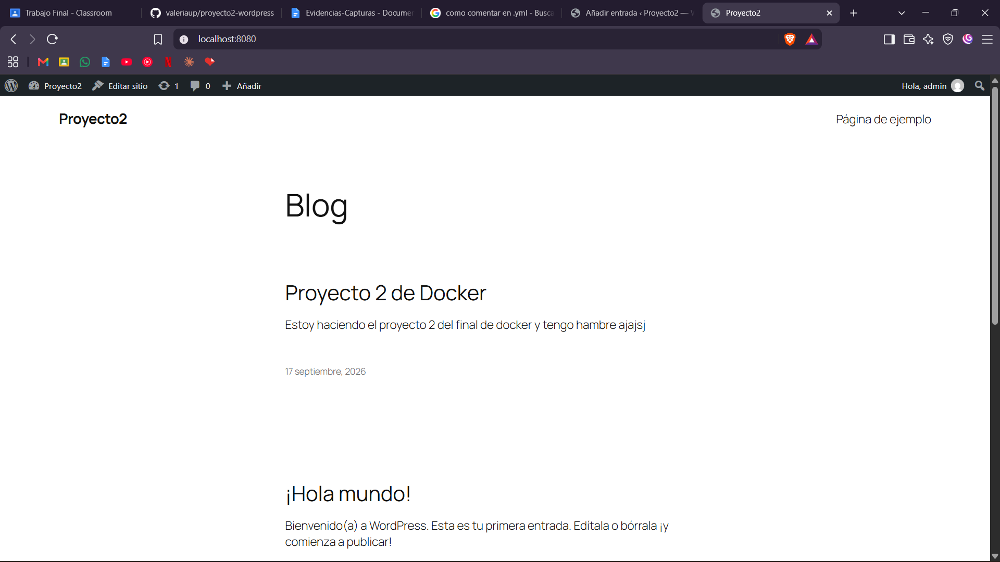

# Proyecto 2 — WordPress persistente con Docker Compose

Sitio WordPress para publicar noticias del programa, orquestado con Docker Compose.
Se levanta con un solo comando, los datos sobreviven al reinicio de los contenedores
y la configuración sensible está externalizada.

Proyectos Prácticos Finales — Docker, Git y CI/CD
Instructor: Richard Betancur — ADSO

## Tecnologías

- WordPress (imagen oficial)
- MySQL 8
- Docker Compose

## Requisitos

- Docker Desktop instalado y en ejecución
- Puerto 8080 libre en la máquina anfitriona

## Estructura
proyecto2-wordpress/
├── evidencias/
├── docker-compose.yml
├── .env.example
├── .gitignore
└── README.md


## Configuración

Copiar la plantilla de variables y completar los valores:

```bash
cp .env.example .env
```

Variables requeridas:

| Variable | Descripción |
|---|---|
| `MYSQL_ROOT_PASSWORD` | Contraseña del usuario root de MySQL |
| `MYSQL_DATABASE` | Nombre de la base de datos de WordPress |
| `MYSQL_USER` | Usuario de la aplicación |
| `MYSQL_PASSWORD` | Contraseña del usuario de la aplicación |
| `WORDPRESS_PORT` | Puerto publicado del sitio |

El archivo `.env` no se versiona: contiene credenciales.

## Ejecución

```bash
docker compose up -d
```

El sitio queda disponible en `http://localhost:8080`.

Verificar el estado de los servicios:

```bash
docker compose ps
```

El servicio `db` debe reportar `Up (healthy)` antes de que WordPress arranque.

## Arquitectura

Dos servicios en una red bridge personalizada (`wordpress_net`), que provee la
resolución por nombre entre contenedores. La base de datos no publica puertos al
anfitrión: solo es accesible desde la red interna.

Dos volúmenes nombrados garantizan la persistencia:

| Volumen | Ruta montada | Contenido |
|---|---|---|
| `db_data` | `/var/lib/mysql` | Base de datos completa |
| `wp_data` | `/var/www/html` | Archivos de WordPress y contenido subido |

MySQL declara un healthcheck con `mysqladmin ping`, y WordPress usa
`depends_on` con `condition: service_healthy` para no arrancar antes de que la
base de datos acepte conexiones.

## Detener el sitio

```bash
docker compose down        # detiene y elimina contenedores, conserva los datos
docker compose down -v     # elimina también los volúmenes (irreversible)
```

## Evidencias

### Servicios en ejecución


Compose espera a que `db` reporte estado saludable antes de crear el contenedor
de WordPress. La diferencia de tiempo entre ambos servicios es visible en la salida.

### Instalación del sitio


### Prueba de persistencia

Entrada publicada antes de detener los servicios:



Detención de los servicios:



Los volúmenes permanecen después de eliminar los contenedores:


La misma entrada sigue publicada al volver a levantar el sitio:



## Preguntas

**¿Qué comando eliminaría también los datos y por qué debe usarse con cuidado?**

`docker compose down -v`. La bandera `-v` elimina los volúmenes nombrados
declarados en el compose. Es una operación irreversible: se perderían la base de
datos completa y todos los archivos subidos, y habría que reinstalar WordPress
desde cero.

**¿Por qué WordPress se conecta al host `db` y no a una dirección IP?**

`db` es el nombre del servicio en el compose, y la red bridge personalizada provee
un DNS interno que lo resuelve a la IP del contenedor. Las direcciones IP de los
contenedores son asignadas dinámicamente y cambian en cada arranque, mientras que
el nombre del servicio es estable. Depender de la IP rompería la configuración en
el siguiente `up`.

**¿Qué aporta el healthcheck frente a un `depends_on` simple?**

Un `depends_on` simple solo espera a que el contenedor de la base de datos *inicie*,
lo cual no significa que MySQL esté listo para aceptar conexiones: la
inicialización del directorio de datos toma varios segundos. Con el healthcheck y
`condition: service_healthy`, Compose espera a que `mysqladmin ping` responda
correctamente antes de crear WordPress, evitando el fallo de conexión en el primer
arranque.